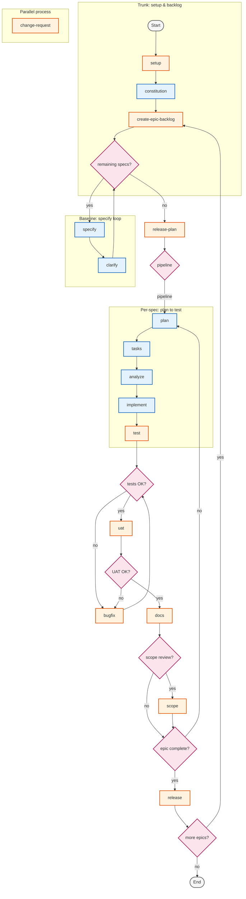

# ACPS Workflow — Spec Kit Extension

**ACPS Workflow** layers a delivery trunk on top of [Spec Kit](https://github.com/github/spec-kit): epic backlog cycling, baseline **release planning**, **plan bridging**, quality gates (test → UAT → docs), optional **scope** review, **release** packaging, **change-request** handling, and **BCP / FP / SNAP** scope counting — while reusing Spec Kit’s core spec/plan/tasks/implement loop.

## Installation

Install the extension with **one** of the methods below, then copy `config/acps-config.template.yml` to `acps-config.yml` in your project (or rely on defaults).

### GitHub Release (recommended)

Each [tagged release](https://github.com/danielvm-ciandt/acps-workflow/releases) publishes a ready-made ZIP:

```bash
# Replace <version> with the desired release (e.g. 1.0.0)
specify extension add acps \
  --from https://github.com/danielvm-ciandt/acps-workflow/releases/download/v<version>/acps-workflow-<version>.zip
```

### GitHub source (latest main)

```bash
specify extension add acps \
  --from https://github.com/danielvm-ciandt/acps-workflow/archive/refs/heads/main.zip
```

### Local development

```bash
specify extension add --dev /path/to/acps-workflow
```

### Troubleshooting

If you see `[SSL: CERTIFICATE_VERIFY_FAILED]` on macOS, your Python installation is missing root certificates. Fix it with:

```bash
# Replace 3.x with your Python version (e.g. 3.12, 3.14)
/Applications/Python\ 3.x/Install\ Certificates.command
```

Or, if using pip-installed Python: `pip3 install --upgrade certifi`.

## Commands

Extension commands are exposed as `speckit.acps.*` (your IDE may show `/workflow.*` aliases).

| Command | Description |
|---------|-------------|
| `speckit.acps.setup` | Bootstrap project environment, agent context, and status files. |
| `speckit.acps.create-epic-backlog` | Build an ordered epic backlog (e.g. `BACKLOG.md`). |
| `speckit.acps.release-plan` | Size the backlog and establish baseline scope in `RELEASE_PLAN.md`. |
| `speckit.acps.plan-bridge` | Align baseline / release plan with the technical plan from `/speckit.plan`. |
| `speckit.acps.test` | Run tests and record evidence (e.g. `TEST_SUMMARY.md`). |
| `speckit.acps.bugfix` | Track and fix failures under `.specify/bugs/`. |
| `speckit.acps.uat` | User acceptance testing with artifacts under `.specify/uat/`. |
| `speckit.acps.docs` | Refresh documentation and agent-facing project notes. |
| `speckit.acps.scope` | Optional scope-impact assessment under `.specify/scope/`. |
| `speckit.acps.release` | Cut a release: changelog / release notes / artifacts. |
| `speckit.acps.change-request` | Register change requests under `.specify/project/`. |
| `speckit.acps.count` | Assess scope via BCP, simplified counting, or FP+SNAP. |

## Workflow

The diagram follows the team-trunk state machine. **Blue** nodes use **Spec Kit core** commands; **orange** nodes use **ACPS extension** commands. **Pink** diamonds are gateways.



**`plan-bridge`** is not a separate node in the SCXML above; run it after **`speckit.plan`** when using ACPS hooks so the technical plan matches the baseline (see `extension.yml`).

## Configuration

- Template: **`config/acps-config.template.yml`**
- Copy to **`acps-config.yml`** and set project name, artifact paths, quality gates, and counting defaults (BCP maturity thresholds, `default_mode`, auto-count after specify).

## Counting

The **`speckit.acps.count`** command supports:

- **full** — Full **BCP** (10 functional + 3 NFR dimensions) using the rubric in `memory/bcp-rubric.md` and prompts under `prompts/`.
- **simplified** — Reduced prompts (e.g. boundaries, business rules, interface elements) for faster triage.
- **fp-snap** — **Function points** + **SNAP**-style assessment paths for teams tracking IFPUG-style sizing alongside BCP.

See `memory/acps-methodology.md` for folder layout (including `.specify/counting/`).

## Agent context

- **`memory/acps-methodology.md`** — Command namespaces, trunk order, folders, CR/release policies.
- **`memory/acps-states.md`** — State IDs, commands, and gateway transitions.
- **`memory/bcp-rubric.md`** — Quick BCP scoring reference.

## Publishing (maintainers)

Releases are automated via GitHub Actions. To publish a new version:

1. Bump `version` in `extension.yml`.
2. Tag and push:

```bash
git tag v1.1.0
git push origin main --tags
```

The workflow creates a GitHub Release with a ZIP artifact.

## License

MIT
